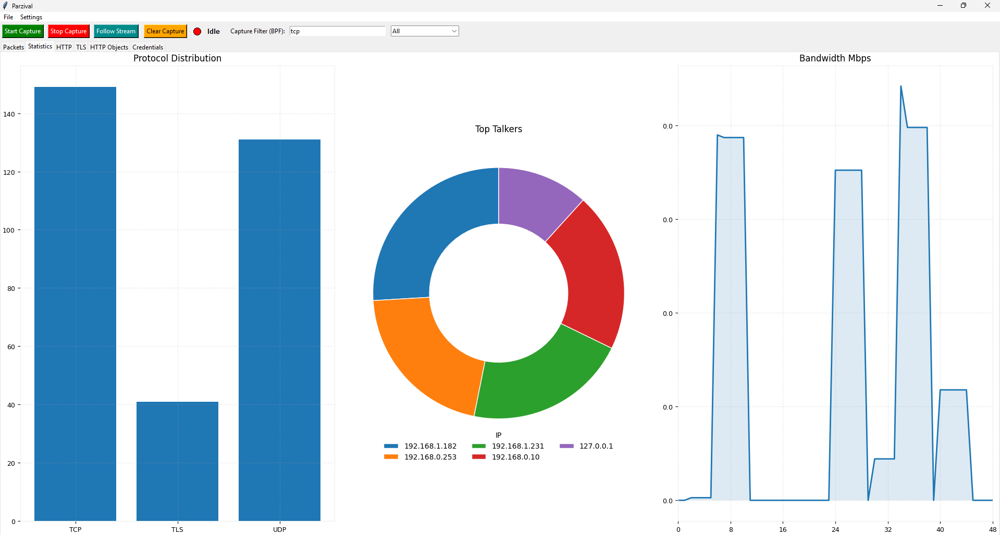

<p align="center">
<b> 🛡️ Parzival - Your Friendly Knight Packet Sniffer</b> 

<p align="center">
  
  
  
  
  
  
</p>

<p align="center">
Parzival is a lightweight network traffic analyzer & packet sniffer built with Python and Tkinter.  
It lets you capture live packets, analyze HTTP/TLS traffic, detect cleartext credentials, and view real-time bandwidth and protocol statistics — all with a simple desktop UI.


---

## 📑 Table of Contents

- [Caution](#%EF%B8%8F-educational-use-only) 
- [Features](#-features)
- [Tech Stack](#%EF%B8%8F-tech-stack)
- [Screenshots](#-screenshots)
- [Installation](#-installation)
- [Running with Sudo / Administrator Privileges](#-running-with-sudo--administrator-privileges)
- [Usage Guide](#%EF%B8%8F-usage-guide)
- [Author](#%E2%80%8D-author)
- [License](#-license)


---

## 🖊️ Educational Use Only

Parzival is provided for learning, research, and testing in controlled environments.  
Use it only on networks and systems that you own or for which you have explicit permission.  
You are responsible for complying with all applicable laws and policies in your jurisdiction.  
The authors and contributors are not liable for misuse, damage, or legal issues that arise from improper use.

---
## ✨ Features

- **✅ Capture & PCAP Import/Export**  
  - Capture network packets in real time using [Scapy](https://scapy.net).  
  - Save & load **PCAP** files easily.  
  - Apply **BPF filters** (e.g., `tcp`, `port 80`, `port 443`).  
  - Quick-select common ports (HTTP, HTTPS, DNS, FTP, SSH, etc.).

- **✅ Color-Coded Packet List**  
  - Auto-scroll table with **protocol-based colors**.  
  - Adjustable, **draggable details pane** showing full packet dump.

- **✅ Preferences Dialog (Persistent JSON Config)**  
  - Change protocol colors and default capture filter.  
  - Saved persistently in the script as a **JSON config** so your changes stay.

- **✅ Statistics Dashboard**  
  - **Protocol Distribution** (bar chart).  
  - **Top Talkers** (donut/pie chart).  
  - **Bandwidth graph** with smoothing & auto-update.

- **✅ HTTP Analyzer Tab**  
  - Filter & search HTTP requests/responses.  
  - Extract payloads & metadata.

- **✅ TLS Analyzer Tab**  
  - View **ClientHello, ServerHello**, and **certificate details**.

- **✅ HTTP Objects Tab**  
  - Browse and **save downloadable HTTP files**.

- **✅ Credentials Tab**  
  - Auto-detect cleartext **usernames/passwords**.  
  - Export credentials to **CSV/XLSX**.

- **✅ Follow TCP Stream Tab**  
  - View full **conversations**.  
  - Export streams to text.

- **✅ Export Functions Everywhere**  
  - Export **packets** to CSV/XLSX.  
  - Export **credentials** to CSV/XLSX.  
  - Export **TCP streams** to TXT.

---

## 🛠️ Tech Stack

- **Python 3.8+**
- **Tkinter** — GUI
- **Scapy** — packet sniffing & analysis
- **Matplotlib** — real-time charts
- **NumPy** — smoothing bandwidth graph
- **Pandas + OpenPyXL** — Excel export
- **CSV** — packet & credential export

---


## 📸 Screenshots

| Packets View | Statistics Dashboard |
|--------------|----------------------|
|  |  |

| HTTP Analysis | TLS Analysis |
|---------------|-------------|
|  |  |

---

## 🚀 Installation

1. **Clone this repository or download as zip**
   ```bash
   git clone https://github.com/AvatarParzival/parzival.git
   cd parzival
   ```

2. **Create a virtual environment (optional but recommended)**
   ```bash
   python -m venv venv
   source venv/bin/activate   # On Windows: venv\Scripts\activate
   ```

3. **Install dependencies**
   ```bash
   pip install -r requirements.txt
   ```
   or manually:
   ```bash
   pip install scapy matplotlib pandas openpyxl numpy
   ```

4. **Run the application**
   ```bash
   python parzival.py
   ```

---

## ⚡ Running with Sudo / Administrator Privileges

Packet sniffing often requires **root or admin access**.  
Here’s how to enable it depending on your system:

### 🐧 Linux

1. Make sure your user is in the `sudo` group:
   ```bash
   groups
   ```
   If you don’t see `sudo`, add yourself:
   ```bash
   su
   usermod -aG sudo yourusername
   exit
   ```
   Then log out and back in.

2. Run Parzival with:
   ```bash
   sudo python3 parzival.py
   ```

---

### 🍏 macOS

- Most admin users already have `sudo`.  
- If not, enable it:  
  **System Settings → Users & Groups → Click your user → “Allow user to administer this computer.”**

- Then run:
  ```bash
  sudo python3 parzival.py
  ```

---

### 🪟 Windows

Windows doesn’t have `sudo`. Instead:

1. Right click **Command Prompt** → “Run as administrator.”
2. Navigate to your Parzival folder:
   ```cmd
   cd C:\path\to\parzival
   ```
3. Run:
   ```cmd
   python parzival.py
   ```

---

## 🖥️ Usage Guide

1. Launch **Parzival**.
2. Choose a **capture filter** or port preset (e.g., HTTP, HTTPS).
3. Click **Start Capture** to begin sniffing.
4. Switch between tabs:
   - **Packets**: color-coded list of captured packets, double-click for full dump.
   - **Statistics**: protocol distribution, top talkers, bandwidth graph.
   - **HTTP**: search/filter HTTP traffic.
   - **TLS**: view handshakes and certificates.
   - **HTTP Objects**: save downloadable files.
   - **Credentials**: review auto-detected creds & export.
   - **Follow TCP Stream**: view conversations & export as text.
5. Use the **File menu** to **save/load PCAP** or **export data** (CSV/XLSX/TXT).

---

## 🧑‍💻 Author

**Parzival** was created and maintained by **Abdullah Zubair**  
- GitHub: [@AvatarParzival](https://github.com/AvatarParzival)
- LinkedIn: [Abdullah Zubair](https://www.linkedin.com/in/abdullahzubairr)
- Email: [abdullah69zubair@gmail.com](abdullah69zubair@gmail.com)

---

## 📜 License

This project is licensed under the **MIT License** — see the [LICENSE](LICENSE) file for details.
